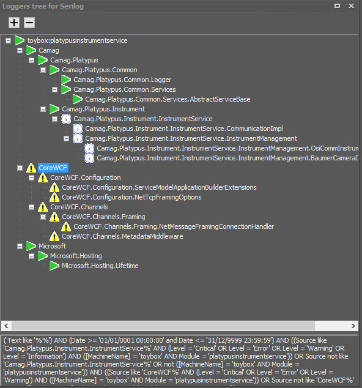
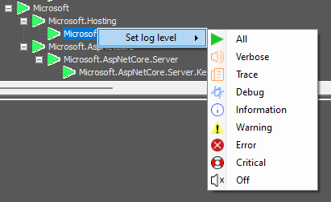

# Analogy Loggers Tree 

Display a tree of of available loggers in corresponding log window, each logger can be individually filtered by level.

## Tree structure

- A new root is created for each unique pair of MachineName:Module
- Each root will show the tree of the different sources (loggers) available
- Each leaf display the current level filter as an Icon

## Filtering

Any leaf of the tree can have a filter applied, which will also be done for the children.
Filtering is done on the log level, via the context menu.

When the filtering is modified, a new SQL query would be created, which is shown at the bottom.
The query is then automatically applied on the corresponding log window.

---
**Important**

Advanced feature *Raw SQL filtering* should be enabled.

---